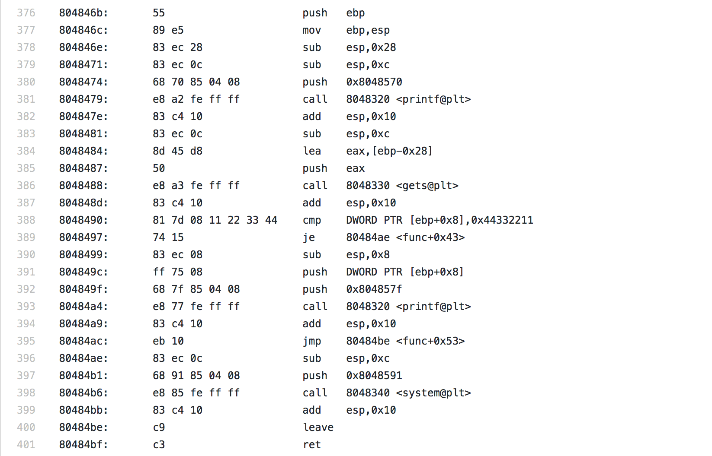

## Reverse Engineering - Introduction

+   Introduction

    

    Reverse Engineering w.r.t software involves any attempt to understand the behaviour of a software by observing peeking at it's binary. Tools such as decompilers, disassemblers and debuggers come in very handy.

+   Recommended texts and Resources

+   Legal Aspect

    TL;DR Except where permission is granted, avoid reversing commercial software. The text and resources above, have more details regarding this.

    In this course, we would be using binary provided by me or from public challenge sites such as: 

    +   [www.reversing.kr](http://www.reversing.kr)

    +   (crackme.org)[] 
 
+   Applications

+   Computer Architecture

    +   Fetch -> Decode -> Execute Cycle


    +   Instruction Set

        +   Intel `x86` instruction set. (Cheatsheet)

    +   Memory Layout

        +   Process Memory

            ```
            0xbfffffff
            |----------------------------------|    -
            |               Stack              |    |  grows downward from high -> low addr
            |                                  |    v
            |----------------------------------|
            |                ...               |
            |                                  |
            |                ...               |
            |----------------------------------|
            |                                  |    ^
            |               Heap               |    |  grows upwards from low -> high addr
            |----------------------------------|    -
            |                                  |
            |        Static and Global         |
            |        ((un)initialized)         |
            |----------------------------------|
            |                ...               |
            |                                  |
            |             Code/Text            |
            |----------------------------------|
            |            0x00000000            |
            |----------------------------------|
            ```

        +   Data sizes

            `char`: 1 byte

            `int`: 4 bytes

            `long`: 8 bytes

            `short`: 2 bytes

            Anything else: use `sizeof` to check

        +   Byte ordering

+   Tools

    +   Decompilers

    +   Disassemblers

    +   Debuggers
