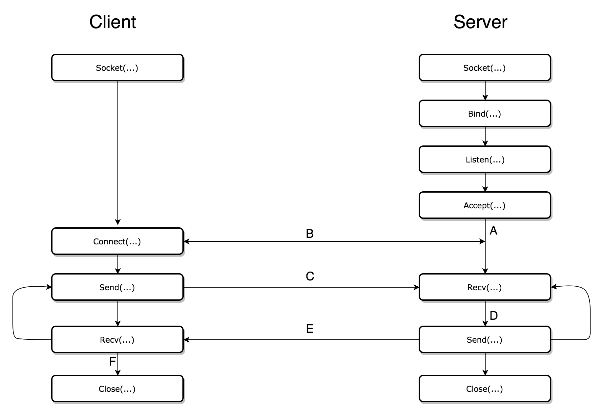

<u>**Socket Programming**</u>

+   <u>What is a socket</u>

    An end-point for network communication using the Operating System. There are different families and types of sockets. Families are the addressing schemes eg AF_INET, AF_UNIX, AF_INET6. Types are the modes of communication eg RAW, DGRAM and STREAM modes.

+   <u>Programming APIs</u>

    Sockets are generally abstracted as files in programming. Some of the APIs include: `socket`, `bind`, `connect`,`listen`, `accept`, `recv`, `send`, etc.

+   <u>Server Programming</u>

    A server is network component that exposes an address, listens for and accepts connections from clients in order to `serve` their requests. Eg. The Google Web server, listening for your search queries, process them and returns the client (browser) a search result.

    Server programming using the socket APIs basically goes in this fashion:

    1.  The server creates/opens a `socket`.

    2.  `bind`s this socket to an address and port (think socket families). A port is one of the many gates to an address.

    3.  The server then `listen`s for and `accept`s connection. At this stage, the server program hangs until connections are made to it from a client.

    4.  The server processes `recv`d requests and `send`s responses.

    The following [server.py](server.py) illustrates a basic server program in python.

+   <u>Client Programming</u>

    A client is a network component that opens a connection to a server in order to exchange data.

    Server programming using the socket APIs basically goes in this fashion:

    1.  The client creates/opens a `socket`

    2.  The client connects to a server by using it's bound address and port

    3.  The client `send`s requests and waits to `recv` responses.

    The following [client.py](client.py) illustrates a basic client program in python

+   <u>Diagram</u>

    The following diagram illustrates the client-server concept. Study the diagram and the following simple client and server programs written in python.

    